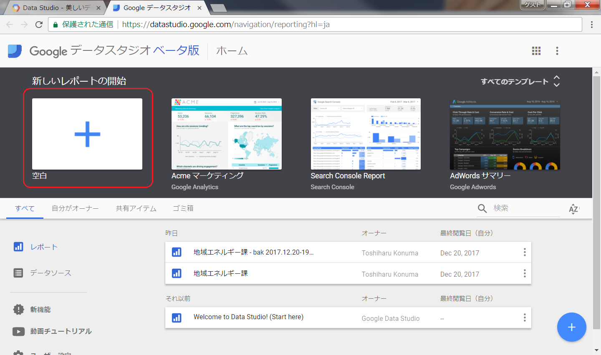
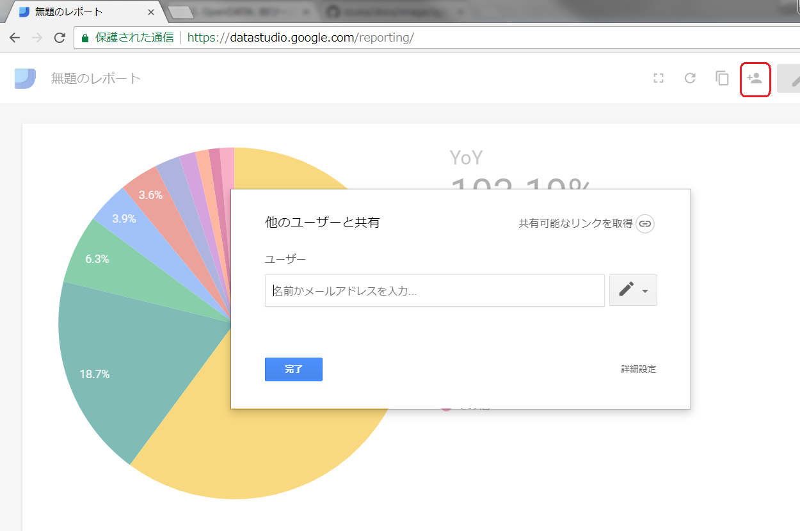

============================================
OpenDATA: BIツールで可視化しよう
============================================

.. |csv| replace:: CSVファイル

目標や実績値の意識付けとして、誰が見ても分かりやすい表現で訴える。という可視化の方法も、意識付けの啓発につながると考えます。また、行政としては情報公開と言う役割も担っているので、目標値や実績値を随時オープンデータとして公開することも今後活発にしていただくことを期待します

と言うことで、オープンデータを可視化に活用できると、積極的にオープンデータも公開したくなり、かつ、公開したオープンデータで数値の意識付けに繋がるので一石二鳥ですね

この資料では、オープンデータとして公開した  |csv| を使って「`BIツール <https://search.yahoo.co.jp/search?p=BI%E3%83%84%E3%83%BC%E3%83%AB>`_」で可視化する方法を説明してみます

完成イメージ
============

======================================================  ======================================================
`この資料のゴール <https://goo.gl/6E3qF9>`_             `作り方に慣れて作り込んだ例 <https://goo.gl/xDuHtG>`_
======================================================  ======================================================
.. image:: ./image/csv2bi/bi-completed-sample.png       .. image:: ./image/csv2bi/bi-completed-application.png
======================================================  ======================================================

事前準備
========

電気使用量のオープンデータ(CSV形式のファイル)
---------------------------------------------

オープンデータとして施設ごとの電気使用量実績が公開されていることを仮定して、この説明のために取り急ぎ作りました。この |csv| を利用してBIツールで可視化してみます

- `電気（全日）使用量 2015年度版 <https://raw.githubusercontent.com/kon104/tzuka/master/open-data/sample/energy-dept/power-usage-allday_2015.csv>`_
- `電気（全日）使用量 2016年度版 <https://raw.githubusercontent.com/kon104/tzuka/master/open-data/sample/energy-dept/power-usage-allday_2016.csv>`_

いただいた Excelファイル から必要な行と列に絞り |csv| を作成しました

CSVからSpreadSheetに集約
========================

|csv| のデータを集約するためにSpreadSheetを使うので、新規にシートを作成します

まず始めに、まっさらのシートの A1 セルに IMPORTDATA 関数を使って2016年度の実績値をシートに取り込みます

.. code-block:: javascript

   =IMPORTDATA("https://raw.githubusercontent.com/kon104/tzuka/master/open-data/sample/energy-dept/power-usage-allday_2016.csv")

セルに関数を入力後に暫く「Loading...」表示を待つとシート全体に |csv| のデータが取り込まれました

.. image:: ./image/csv2bi/gspreadsheet-import-csv2016.png

A列からQ列までが |csv| から取り込まれたデータで、可視化には集計値も欲しいのでR列以降に四半期計、半期計、年度計の計算を加えてください

.. image:: ./image/csv2bi/gspreadsheet-import-csv2016-addcalc.png

データの可視化としては、一つだけの年度だけでは面白く無いので、シートを追加して前年度分の |csv| も同じ方法で取り込みます

複数年度のデータが揃ったら、やはり可視化としては対前年比も欲しいので、シートを追加して比較計算をしてみます

複数年度を一つのシートにまとめる場合、メインに見せる年度は「=」で別シートを直接参照しても良いが、比較先の年度は「VLOOOK 関数」で別シートからデータを見つける方法が柔軟で良いですね

.. image:: ./image/csv2bi/gspreadsheet-yoy-ref2015.png

各年度ごとの合計値と、対前年比較のデータが揃ったSpreadSheetが用意できました

以後はこのSpreadSheetを活用してBIツールで可視化していきます

SpreadSheetをBIで可視化
=======================

Data Studio(BIツール)を使って可視化を進めていきましょう。「DATA STUDIO を起動する」をクリックします

.. image:: ./image/csv2bi/gdstudio-entry.png

新しいれｂポートの開始では、「＋」を選択し新しいレポートの作成を開始します

レポートに表示するデータを関連付けするため「新しいデータソースを作成」をクリックします

.. image:: ./image/csv2bi/gdstudio-newreport.png

今回は前章で作成したSpreadSheetをデータソースにしたいので、「スプレッドシート ＞ 自分がオーナー ＞ 電気(全日)使用料 ＞ YoY2016」のように作成したSpreadSheetのデータが入っているシートを指定します

.. image:: ./image/csv2bi/gdstudio-newdatasrc.png

データソースの項目に対して、適切なデータ型をしていします。テキストや数値のある程度は自動的に判断しますが、パーセントや日付など自動に判断できなかった項目は手作業で直してあげます

.. image:: ./image/csv2bi/gdstudio-datasrc-edit.png

「レポートに追加」をクリックしてレポートにデータソースを関連づけます

では、データソースから実際にグラフで可視化して見ましょう。円グラフアイコンを選択してレポート上に配置して見ましょう

.. image:: ./image/csv2bi/gdstudio-report-piechart-icon.png

円グラフが配置されましたが、表示している値はコード番号の数値情報のため意味がないので、指標をクリックして表示する値を変えて見ます

.. image:: ./image/csv2bi/gdstudio-report-piechart-layout.png

年度計を可視化したいので「FY2016」を選択します

.. image:: ./image/csv2bi/gdstudio-report-piechart-change-value.png

次に対前年比を表示するとインパクトがありそうなので、スコアカードアイコンを選択してレポート上に配置します。指標も「YoY」に変更します

.. image:: ./image/csv2bi/gdstudio-report-scorecard.png

これで今回のお手本としては完成なので「ビュー」をクリックして出来上がりを確認しましょう

.. image:: ./image/csv2bi/gdstudio-report-view.png

公開用URLの取得
===============

可視化したグラフを公開するには「このレポートを共有」アイコンをクリックして「他のユーザと共有」ダイアログを表示します

「共有可能なリンクを取得」をクリックすると得られるURLでグラフをお知らせすることで共有してみてください

.. image:: ./image/csv2bi/gdstudio-report-share-geturl.png

