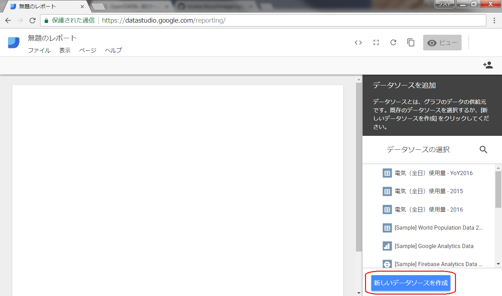
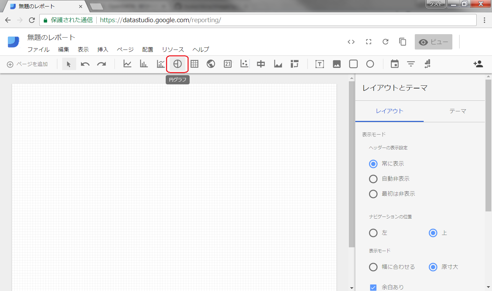
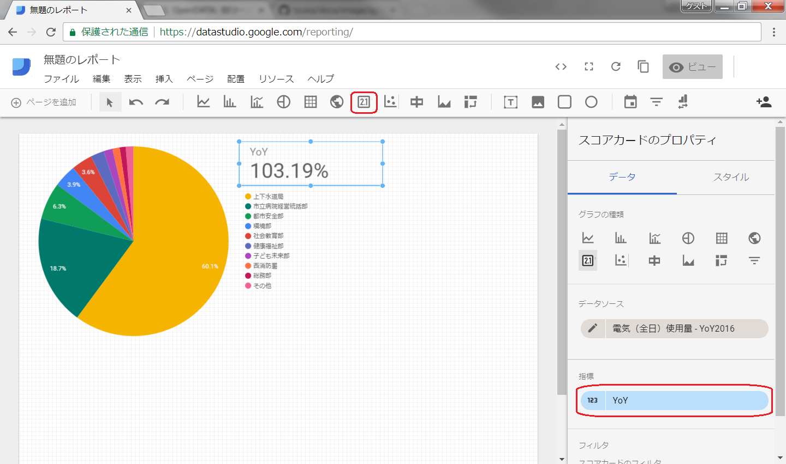

============================================
OpenDATA: BIツールで可視化しよう
============================================

.. |csv| replace:: CSVファイル

目標や実績値の意識付けとして、誰が見ても分かりやすい表現で訴える。という可視化の方法も、意識付けの啓発につながると考えます。また、行政としては情報公開と言う役割も担っているので、目標値や実績値を随時オープンデータとして公開することも今後活発にしていただくことを期待します

と言うことで、オープンデータを可視化に活用できると、積極的にオープンデータも公開したくなり、かつ、公開したオープンデータで数値の意識付けに繋がるので一石二鳥ですね

この資料では、オープンデータとして公開した  |csv| を使って `BI <https://ja.wikipedia.org/wiki/%E3%83%93%E3%82%B8%E3%83%8D%E3%82%B9%E3%82%A4%E3%83%B3%E3%83%86%E3%83%AA%E3%82%B8%E3%82%A7%E3%83%B3%E3%82%B9>`_ ツールで可視化する方法を説明してみます

完成イメージ
============

=================================================   ======================================================
`この資料のゴール <https://goo.gl/6E3qF9>`_         `さらに作り込んだ例 <https://goo.gl/xDuHtG>`_
=================================================   ======================================================
.. image:: ./image/csv2bi/bi-completed-sample.png   .. image:: ./image/csv2bi/bi-completed-application.png
=================================================   ======================================================

事前準備
========

電気使用量のオープンデータ(CSV形式のファイル)
---------------------------------------------

オープンデータとして施設ごとの電気使用量実績が公開されていることを仮定して、この説明のために取り急ぎ作りました。この |csv| を利用してBIツールで可視化してみます

- `電気（全日）使用量 2015年度版 <https://raw.githubusercontent.com/kon104/tzuka/master/open-data/sample/energy-dept/power-usage-allday_2015.csv>`_
- `電気（全日）使用量 2016年度版 <https://raw.githubusercontent.com/kon104/tzuka/master/open-data/sample/energy-dept/power-usage-allday_2016.csv>`_

CSVからSpreadSheetに集約
========================

.. code-block:: javascript

   =IMPORTDATA("https://raw.githubusercontent.com/kon104/tzuka/master/open-data/sample/energy-dept/power-usage-allday_2016.csv")

.. image:: ./image/csv2bi/gspreadsheet-import-csv2016-addcalc.png

.. image:: ./image/csv2bi/gspreadsheet-import-csv2015.png

.. image:: ./image/csv2bi/gspreadsheet-yoy-ref2015.png

.. image:: ./image/csv2bi/gspreadsheet-yoy-ref2016.png

.. image:: ./image/csv2bi/gspreadsheet-yoy-rate.png

SpreadSheetをBIで可視化
=======================

.. image:: ./image/csv2bi/gdstudio-list.png

.. image:: ./image/csv2bi/gdstudio-datasrc-edit.png

.. image:: ./image/csv2bi/gdstudio-adddatasrc.png

.. image:: ./image/csv2bi/gdstudio-report-piechart-layout.png

.. image:: ./image/csv2bi/gdstudio-report-view.png

公開用URLの取得
===============

.. image:: ./image/csv2bi/gdstudio-report-share-init.png

.. image:: ./image/csv2bi/gdstudio-report-share-geturl.png

