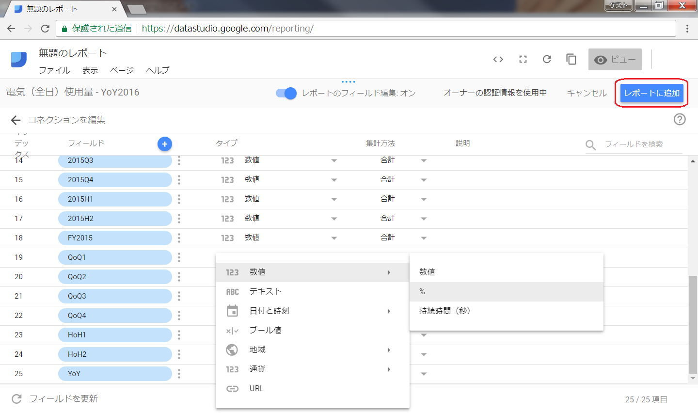
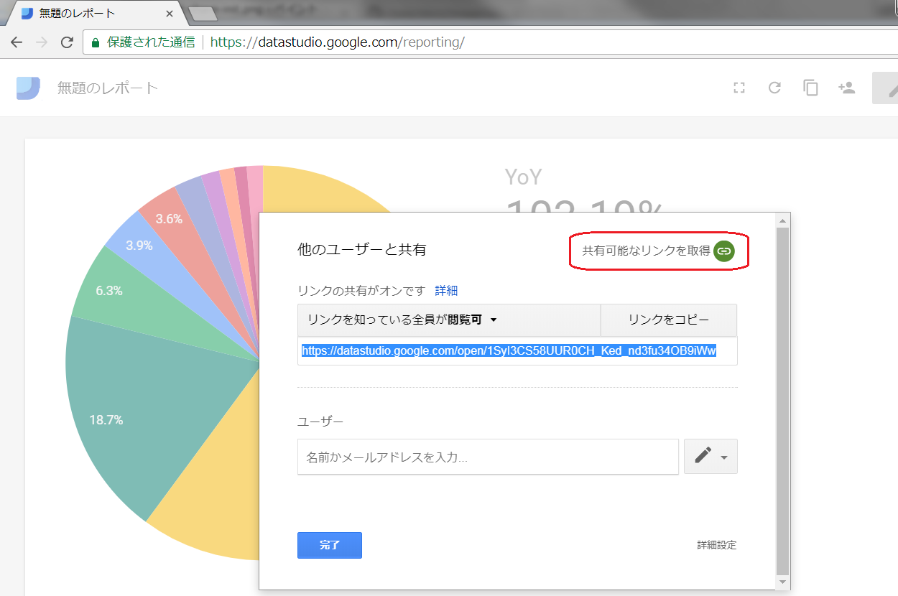

============================================
OpenDATA: BIツールで可視化しよう
============================================

.. |csv| replace:: CSVファイル

目標や実績値の意識付けとして、誰が見ても分かりやすい表現で訴える。という可視化の方法も、意識付けの啓発につながると考えます。また、行政としては情報公開と言う役割も担っているので、目標値や実績値を随時オープンデータとして公開することも今後活発にしていただくことを期待します

と言うことで、オープンデータを可視化に活用できると、数値の意識付けと、積極的なオープンデータ構築の一石二鳥になるので、その方法を一つ提案させていただきます

|csv| でオープンデータを公開し、その |csv| を活用して `BI <https://ja.wikipedia.org/wiki/%E3%83%93%E3%82%B8%E3%83%8D%E3%82%B9%E3%82%A4%E3%83%B3%E3%83%86%E3%83%AA%E3%82%B8%E3%82%A7%E3%83%B3%E3%82%B9>`_ ツールで可視化してみましょう

取り急ぎ画像：CSVからSpreadSheetに集約
======================================

.. image:: ./image/csv2bi/gspreadsheet-import-csv2016.png

.. image:: ./image/csv2bi/gspreadsheet-import-csv2016-addcalc.png

.. image:: ./image/csv2bi/gspreadsheet-import-csv2015.png

.. image:: ./image/csv2bi/gspreadsheet-yoy-ref2016.png

.. image:: ./image/csv2bi/gspreadsheet-yoy-rate.png

取り急ぎ画像：SpreadSheetをBIツールで見やすく
=============================================

.. image:: ./image/csv2bi/gdstudio-entry.png

.. image:: ./image/csv2bi/gdstudio-list.png

.. image:: ./image/csv2bi/gdstudio-newreport.png

.. image:: ./image/csv2bi/gdstudio-newdatasrc.png

.. image:: ./image/csv2bi/gdstudio-adddatasrc.png

.. image:: ./image/csv2bi/gdstudio-report-piechart-icon.png

.. image:: ./image/csv2bi/gdstudio-report-piechart-layout.png

.. image:: ./image/csv2bi/gdstudio-report-piechart-change-value.png

.. image:: ./image/csv2bi/gdstudio-report-scorecard.png

.. image:: ./image/csv2bi/gdstudio-report-share-init.png

