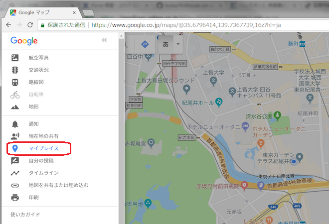
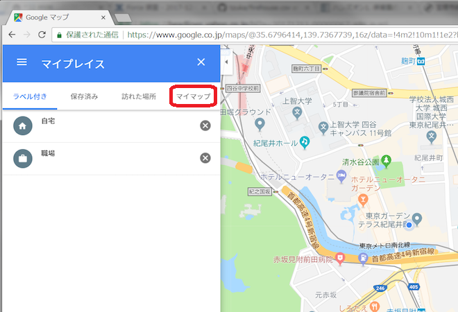
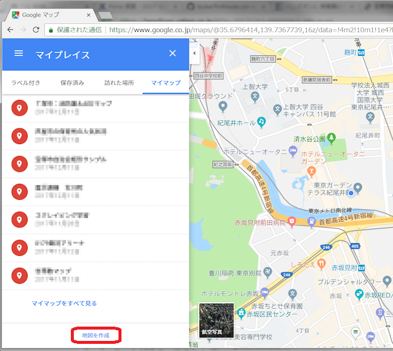
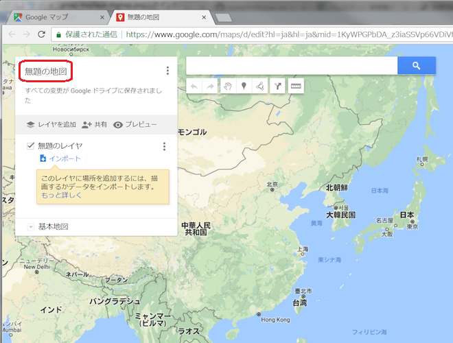
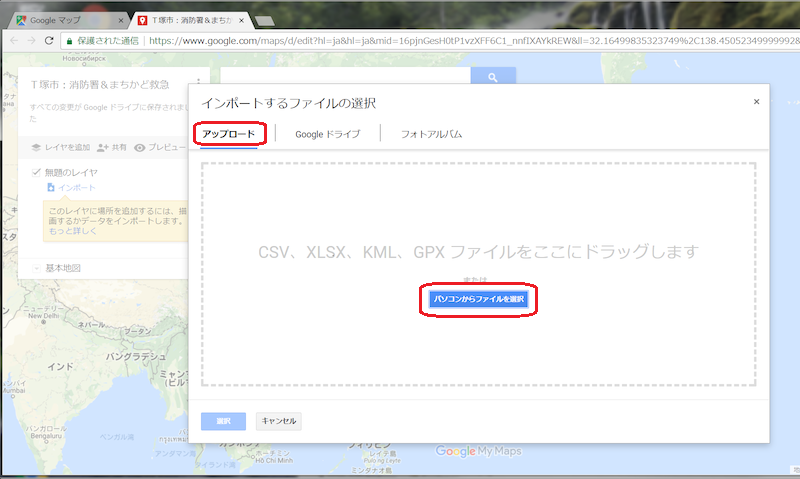
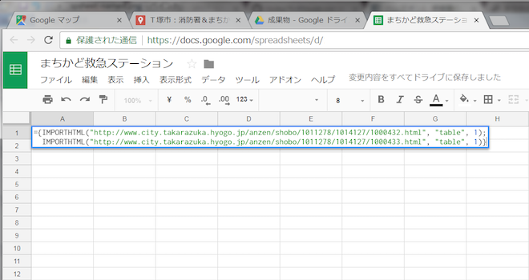
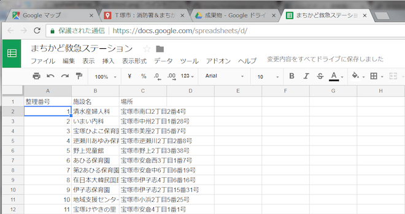

============================================
マーカー入り地図を作ろう（おまけ付き）
============================================

CSV形式のデータが行政からオープンデータとして公開されるケースが多いので、施設一覧のCSVデータを活用してプログラムを書かなくても地図上に情報表示をする方法を説明します

.. toctree::
   :maxdepth: 2

完成イメージ
============

※ 本当はY!Mapで実現したかったが、プログラムスキルなしで実現する手段がなかったため、泣く泣くGMapで方法を解説しております m(_ _)m

消防署一覧のCSVデータがオープンデータとして公開されていることを想定して地図に情報表示をさせています

また、おまけとして、それだけでは寂しかったので、ホームページで掲載されている記事(TABLEタグの表形式)からデータを吸い出して地図に情報表示する方法も追加してみました

.. raw:: html

	<table border="1" class="colwidths-given docutils">
	<tr><th>CSVデータ</th><th>CSVデータ＋TABLEタグ</th></tr>
	<tr>

	<td><iframe
      src="https://www.google.com/maps/d/u/0/embed?mid=1AYM_VDPLhmb2IRQVPr7PDWtqVL6MDxAZ&ll=34.79960279193115,135.35992562770844&z=15"
      width="310"
      height="400"></iframe></td>

    <td><iframe 
      src="https://www.google.com/maps/d/embed?mid=16pjnGesH0tP1vzXFF6C1_nnfIXAYkREW&ll=34.79960279193115,135.35992562770844&z=15" 
      width="310" 
      height="400"></iframe></td>

	</tr>
	</table>

事前準備
========

施設情報のオープンデータ(CSV形式のファイル)
-------------------------------------------

オープンデータとして消防署一覧が公開されていることを仮定して、この説明のために取り急ぎ作りました

- `市内の消防署一覧 <https://raw.githubusercontent.com/kon104/tzuka/master/open-data/sample/firehouse/firehouse.csv>`_

なお、このデータは市のホームページ「`消防本部トップページ ＞ 組織施設 <http://www.city.takarazuka.hyogo.jp/1008153/1002632/>`_」から各施設の情報を抜き出して作りました

施設情報のホームページ記事（TABLEタグの表形式)
-----------------------------------------------

サンプルで作成したオープンデータだけでは寂しかったので、以下のホームページ記事に掲載されていた表形式の施設情報も抜き出して地図に表示させてみました

- `まちかど救急ステーション（民間施設） <http://www.city.takarazuka.hyogo.jp/anzen/shobo/1011278/1014127/1000432.html>`_
- `まちかど救急ステーション（公共施設） <http://www.city.takarazuka.hyogo.jp/anzen/shobo/1011278/1014127/1000433.html>`_

【工事中】作成手順(取り急ぎ画像を貼り付け)
=====================

マイマップを作成する
--------------------

.. image:: ./image/csv2marker/gmap-1stview.png

.. image:: ./image/csv2marker/gmap-mymap-title-2type.png
.. image:: ./image/csv2marker/gmap-mymap-titled.png

CSVからマーカーを配置する
-------------------------

.. image:: ./image/csv2marker/gmap-1layer-02location.png
.. image:: ./image/csv2marker/gmap-1layer-03title.png
.. image:: ./image/csv2marker/gmap-1layer-11loaded.png
.. image:: ./image/csv2marker/gmap-1layer-12style.png
.. image:: ./image/csv2marker/gmap-1layer-13name_style.png
.. image:: ./image/csv2marker/gmap-1layer-14color.png
.. image:: ./image/csv2marker/gmap-1layer-99completed.png

ホームページのTABLEタグからマーカーを配置する
---------------------------------------------

TABLEタグからSpread Sheetへデータ化する
^^^^^^^^^^^^^^^^^^^^^^^^^^^^^^^^^^^^^^^^^^^^^^

.. image:: ./image/csv2marker/spsheet-00create.png
.. image:: ./image/csv2marker/spsheet-01named.png

Spread Sheetからマーカー化する
^^^^^^^^^^^^^^^^^^^^^^^^^^^^^^

.. image:: ./image/csv2marker/gmap-2layer-01added.png
.. image:: ./image/csv2marker/gmap-2layer-11import.png
.. image:: ./image/csv2marker/gmap-2layer-12location.png
.. image:: ./image/csv2marker/gmap-2layer-21completed.png

マイマップが完成
----------------

.. image:: ./image/csv2marker/gmap-myplace-added.png

埋め込み用のURLを取得する
=========================

.. image:: ./image/csv2marker/gmap-mymap_share_setting.png
.. image:: ./image/csv2marker/gmap-mymap_share_url.png

.. image:: ./image/csv2marker/gmap-embed_00menu.png
.. image:: ./image/csv2marker/gmap-embed_01menu.png

埋め込んだ例
===========

かきくけこさしすせそ

.. code-block:: html

    <iframe
      src="https://www.google.com/maps/d/u/0/embed?mid=16pjnGesH0tP1vzXFF6C1_nnfIXAYkREW"
      width="640"
      height="480"></iframe>

.. raw:: html

    <iframe src="https://www.google.com/maps/d/u/0/embed?mid=16pjnGesH0tP1vzXFF6C1_nnfIXAYkREW" width="640" height="480"></iframe>

.. raw:: html

    <iframe 
     src="https://www.google.com/maps/d/embed?mid=16pjnGesH0tP1vzXFF6C1_nnfIXAYkREW&ll=34.79960279193115,135.35992562770844&z=15" 
     width="640" 
     height="480"></iframe>

