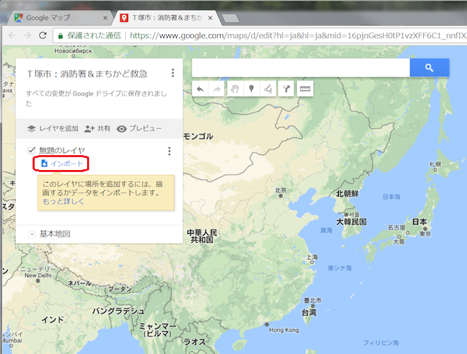
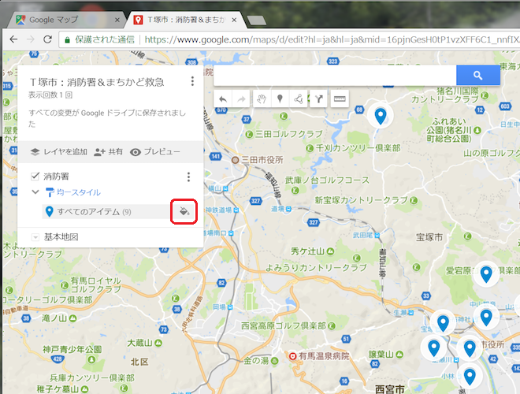
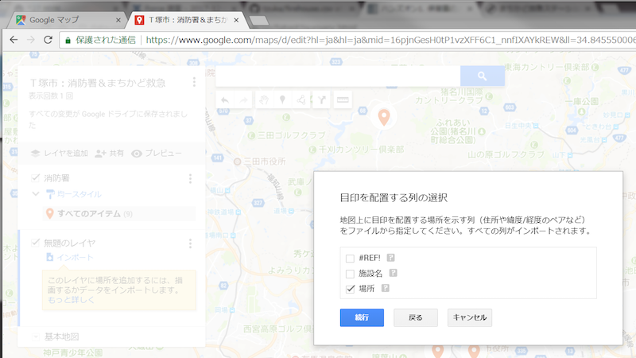
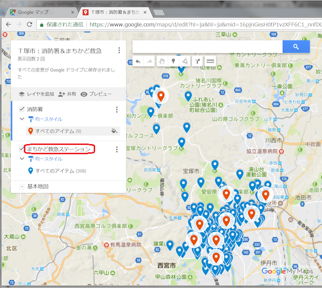

===================================
CSVからマーカー入り地図を作ろう
===================================

あいうえお

.. toctree::
   :maxdepth: 2

作成手順(取り急ぎ画像を貼り付け)
=====================

マイマップを作成する
--------------------

.. image:: ./image/csv2marker/gmap-1stview.png

.. image:: ./image/csv2marker/gmap-init_menu.png
.. image:: ./image/csv2marker/gmap-init_myplace.png
.. image:: ./image/csv2marker/gmap-init_mymap.png

.. image:: ./image/csv2marker/gmap-mymap-title_1no.png
.. image:: ./image/csv2marker/gmap-mymap-title-2type.png

CSVからマーカーを配置する
-------------------------

.. image:: ./image/csv2marker/gmap-1layer-01import.png

.. image:: ./image/csv2marker/gmap-1layer-03title.png
.. image:: ./image/csv2marker/gmap-1layer-11loaded.png
.. image:: ./image/csv2marker/gmap-1layer-12style.png

.. image:: ./image/csv2marker/gmap-1layer-14color.png
.. image:: ./image/csv2marker/gmap-1layer-99completed.png

ホームページのTABLEタグからマーカーを配置する
---------------------------------------------

TABLEタグからSpread Sheetへデータ化する
^^^^^^^^^^^^^^^^^^^^^^^^^^^^^^^^^^^^^^^^^^^^^^

.. image:: ./image/csv2marker/spsheet-01named.png
.. image:: ./image/csv2marker/spsheet-02importhtml.png
.. image:: ./image/csv2marker/spsheet-03loaded.png

Spread Sheetからマーカー化する
^^^^^^^^^^^^^^^^^^^^^^^^^^^^^^

.. image:: ./image/csv2marker/gmap-2layer-01added.png
.. image:: ./image/csv2marker/gmap-2layer-11import.png

マイマップが完成
----------------

.. image:: ./image/csv2marker/gmap-myplace-added.png

埋め込み用のURLを取得する
-------------------------

.. image:: ./image/csv2marker/gmap-mymap_share_setting.png
.. image:: ./image/csv2marker/gmap-mymap_share_url.png

.. image:: ./image/csv2marker/gmap-embed_00menu.png
.. image:: ./image/csv2marker/gmap-embed_01menu.png

