============================================
OpenDATA: マーカー入り地図を作ろう
============================================

.. |csv| replace:: CSVファイル

`CSV <https://ja.wikipedia.org/wiki/Comma-Separated_Values>`_ 形式のデータが行政からオープンデータとして公開されるケースが多いので、施設一覧の |csv| を活用してプログラムを書かなくても地図上に情報表示をする方法を説明します

完成イメージ
============

.. caution::

  **本当はY!Mapで実現したかったが、プログラムスキルなしで実現する手段がなかったため、泣く泣くGMapで方法を解説しております...**

消防署一覧の |csv| がオープンデータとして公開されていることを想定して地図に情報表示をさせています

また、おまけとして、CSVのデータ量がそれほど用意でず寂しかったので、ホームページで掲載されている記事で、表形式のTABLEタグ部分からデータを吸い出して（スクレイピング）、地図に情報表示する方法も書いてみました

**（なお、スクレイピング手法は、オープンデータを元にした活用では無いため、あくまでこんなやり方もあるんだなぁ。の習得レベルでご理解ください）**

.. raw:: html

	<table border="1" class="colwidths-given docutils">
	<tr><th>CSVデータ</th><th>CSVデータ＋TABLEタグ</th></tr>
	<tr>

	<td><iframe
      src="https://www.google.com/maps/d/u/0/embed?mid=1AYM_VDPLhmb2IRQVPr7PDWtqVL6MDxAZ&ll=34.79960279193115,135.35992562770844&z=13"
      width="310"
      height="400"></iframe></td>

    <td><iframe 
      src="https://www.google.com/maps/d/embed?mid=16pjnGesH0tP1vzXFF6C1_nnfIXAYkREW&ll=34.79960279193115,135.35992562770844&z=15" 
      width="310" 
      height="400"></iframe></td>

	</tr>
	</table>

事前準備
========

施設情報のオープンデータ(CSV形式のファイル)
-------------------------------------------

オープンデータとして消防署一覧が公開されていることを仮定して、この説明のために取り急ぎ作りました。この |csv| を利用して地図へマーカー表示させてみます

- `市内の消防署一覧 <https://raw.githubusercontent.com/kon104/tzuka/master/open-data/sample/firehouse/firehouse.csv>`_

なお、この |csv| は市のホームページ「`消防本部トップページ ＞ 組織施設 <http://www.city.takarazuka.hyogo.jp/1008153/1002632/>`_」から各施設の情報を抜き出して作りました

施設情報のホームページ記事（TABLEタグの表形式)
-----------------------------------------------

サンプルで作成したオープンデータだけでは寂しかったので、以下のホームページ記事に掲載されている表形式の施設情報もスクレイピングして地図にマーカー表示させてみます

- `まちかど救急ステーション（民間施設） <http://www.city.takarazuka.hyogo.jp/anzen/shobo/1011278/1014127/1000432.html>`_
- `まちかど救急ステーション（公共施設） <http://www.city.takarazuka.hyogo.jp/anzen/shobo/1011278/1014127/1000433.html>`_

地図にマーカー配置する手順
==========================

マイマップを作成
----------------

マーカー表示などのオリジナルの地図を作成する「マイマップ」機能を活用します。と言うことで、まずはマイマップの作成から開始しましょう

検索ボックスの左横にある三本線のメニューボタンを押下してメニューを表示します

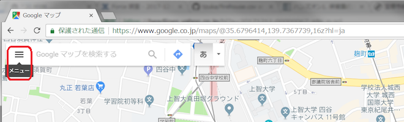

表示したメニューの中から「マイプレイス」を選択します

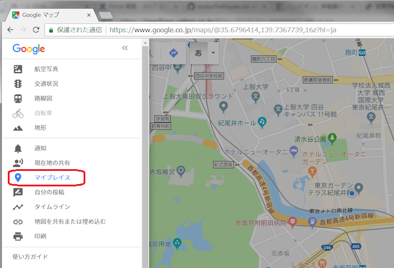

マイプレイスサイドバーの中から「マイマップ」タブを選択します

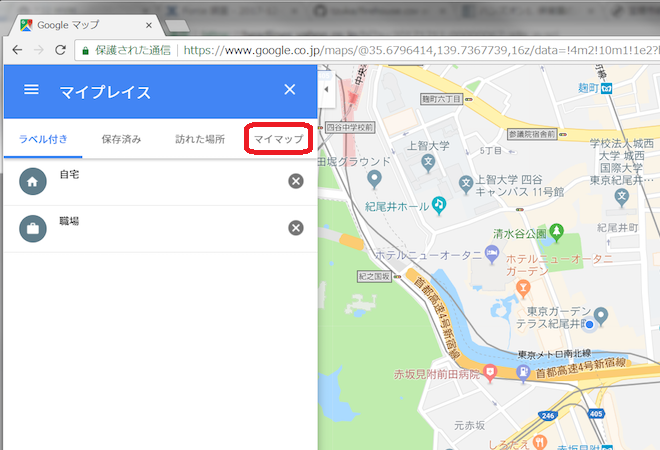

マイマップ一覧を表示したらリストの一番下に表示されている「地図を作成」を選択します

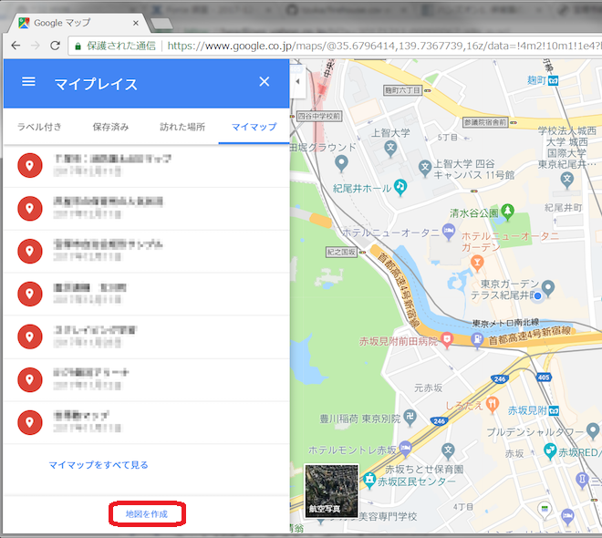

マイマップの作成画面が表示されたら、まず始めに「無題の地図」をクリックします

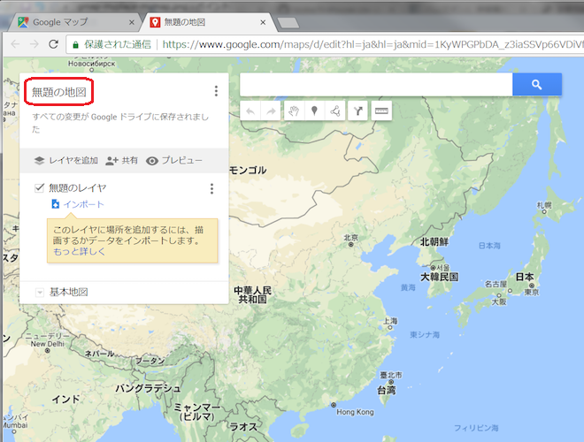

好きな地図タイトルを入力したら「保存」ボタンで保存します

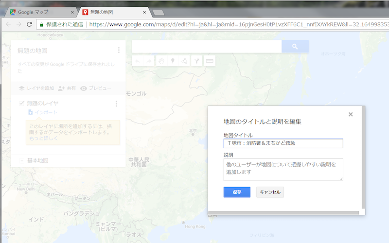

ここまでの作業で、マイマップが出来ましたので、あとはオリジナルの修飾をしていきましょう

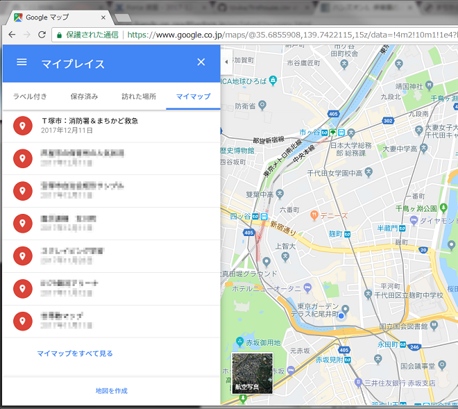

CSVからマーカー配置
-------------------

事前に「`市内の消防署一覧 <https://raw.githubusercontent.com/kon104/tzuka/master/open-data/sample/firehouse/firehouse.csv>`_」の |csv| をダウンロードしておきます

|csv| をアップロードするために、無題のレイヤの「インポート」をクリックします

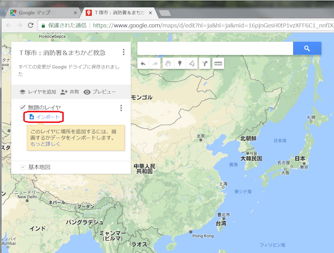

「パソコンからファイルを選択」をクリックして事前にダウンロードしていた |csv| を選択します

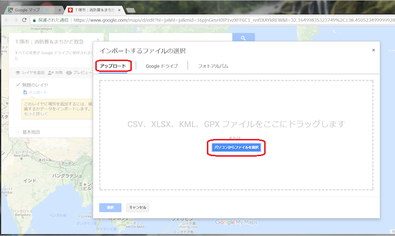

|csv| の中からマーカーを配置する位置情報を示す列を指定します

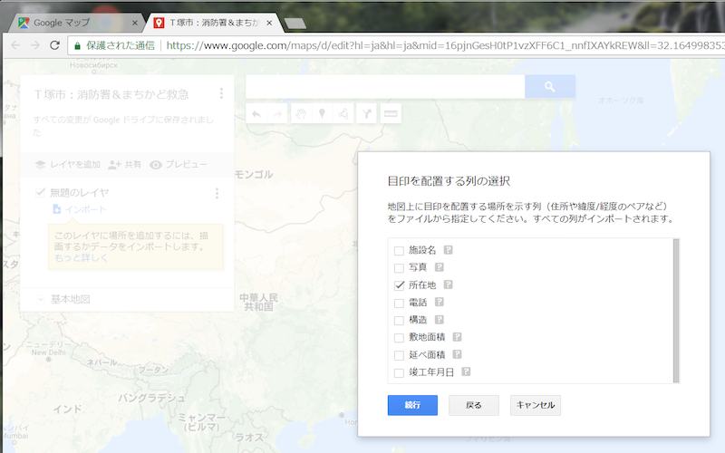

|csv| の中からマーカーのタイトルを示す列を指定します

地図上にマーカーが配置されましたが、色を変更したいので「個別スタイル」をクリックします

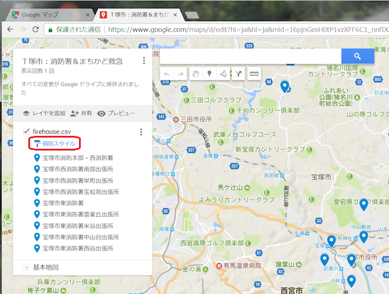

一括してスタイル変更できるように「個別スタイル」をクリックして「均一スタイル」に変更します

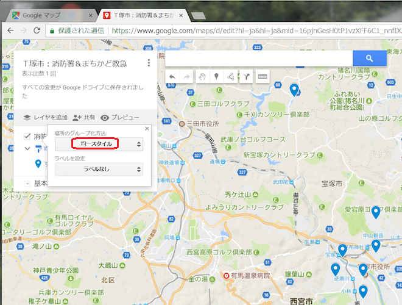

「すべてのアイテム」右横にある「ペンキアイコン」をクリックしてマーカーのスタイルを変更します

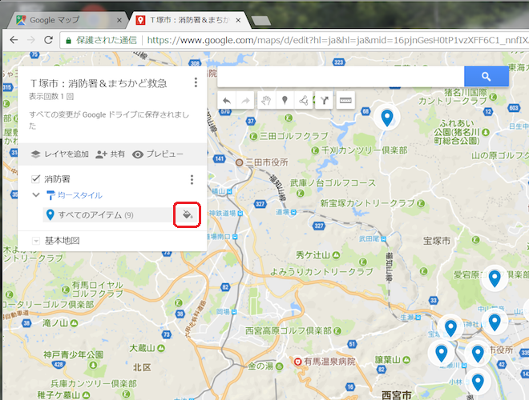

ここでマーカーの色やアイコンを変更できます。今回は青色からオレンジ色へ変更します

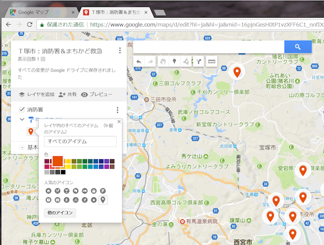

以上で |csv| からマーカーの配置は完成です

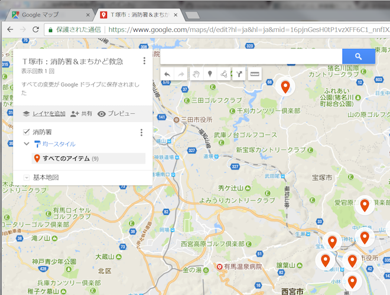

TABLEタグからマーカー配置
-------------------------

ホームページのTABLEタグからSpread Sheetにデータを吸い出します。そのSpread Sheetから地図にマーカーで表示します

TABLEタグからSpread Sheetに読み込み
^^^^^^^^^^^^^^^^^^^^^^^^^^^^^^^^^^^

TABLEタグを吸い出すSpread Sheetを新規に作成するため、`ドライブ アプリ <https://www.google.com/intl/ja_ALL/drive/>`_ の右クリックメニューから選択します

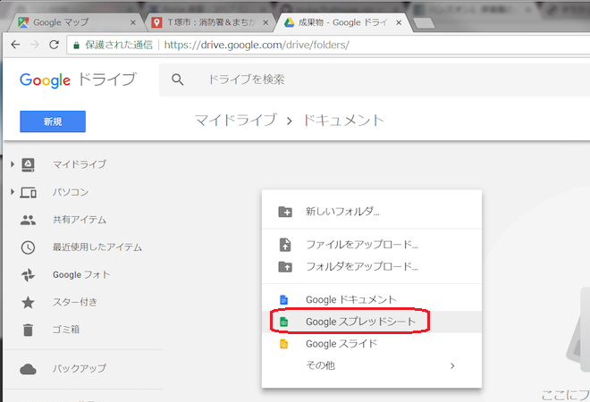

好きなシート名を付けます

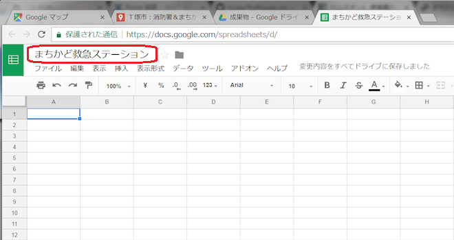

「`まちかど救急ステーション（民間施設） <http://www.city.takarazuka.hyogo.jp/anzen/shobo/1011278/1014127/1000432.html>`_」と「`まちかど救急ステーション（公共施設） <http://www.city.takarazuka.hyogo.jp/anzen/shobo/1011278/1014127/1000433.html>`_」のそれぞれのページ内のTABLEタグからSpead Sheetへ吸い出すには `IMPORTHTML <https://support.google.com/docs/answer/3093339?hl=ja>`_ 関数を利用します

.. code-block:: javascript

    ={IMPORTHTML("http://www.city.takarazuka.hyogo.jp/anzen/shobo/1011278/1014127/1000432.html", "table", 1);
      IMPORTHTML("http://www.city.takarazuka.hyogo.jp/anzen/shobo/1011278/1014127/1000433.html", "table", 1)}

Spread Sheetの「A1」セルに関数式を入力します

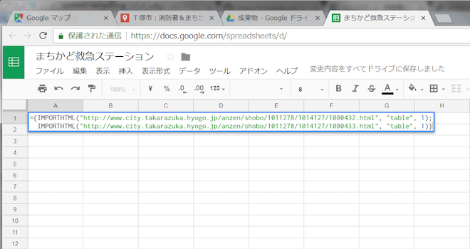

関数式の入力後に Loading... をしばらく待つとSpread Sheetにデータが読み込まれます

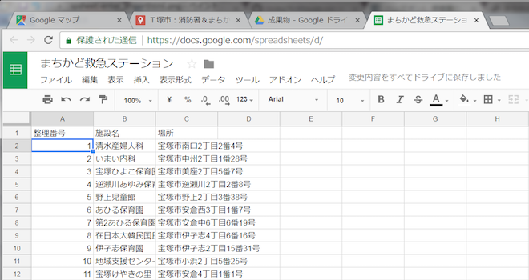

Spread Sheetの準備は以上で完了です

Spread Sheetからマーカー
^^^^^^^^^^^^^^^^^^^^^^^^

「レイヤーを追加」をクリックしてSpread Sheetを読み込むレイヤーを用意し、「インポート」をクリックします

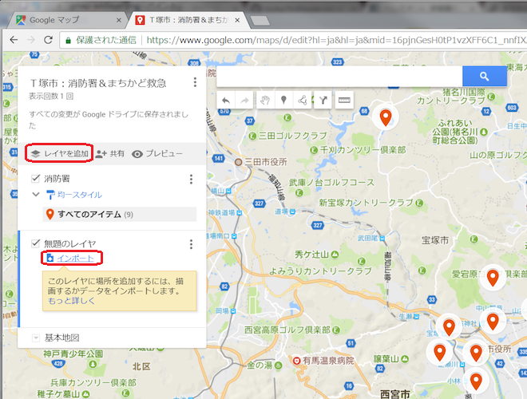

インポートするファイルの選択画面で「Google ドライブ」を選び、地図にマーカーを配置するSpread Sheetを選びます

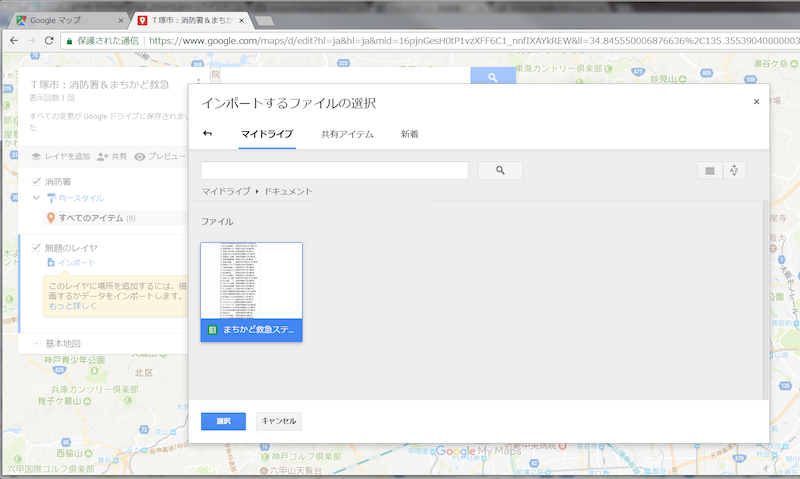

Spread Sheetの中からマーカーを配置する位置情報を示す列を指定します

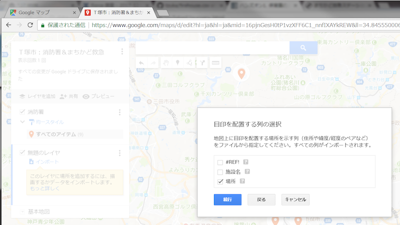

レイヤー名をクリックして好きな名前を付ければSpread Sheetからマーカーの配置は完了です

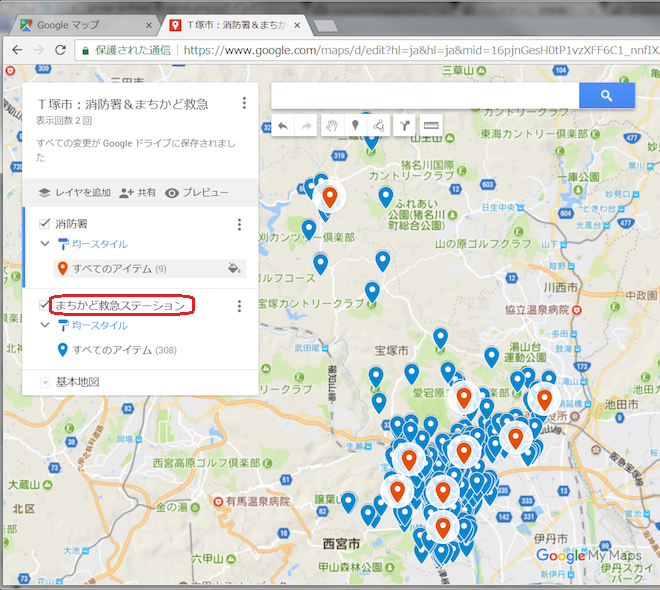

埋め込み用のHTMLを取得
=========================

ホームページに埋め込むには、まず始めにマイマップを公開に設定します

「共有」をクリックして共有設定画面を表示します。アクセス範囲を変えるため「変更」をクリックします

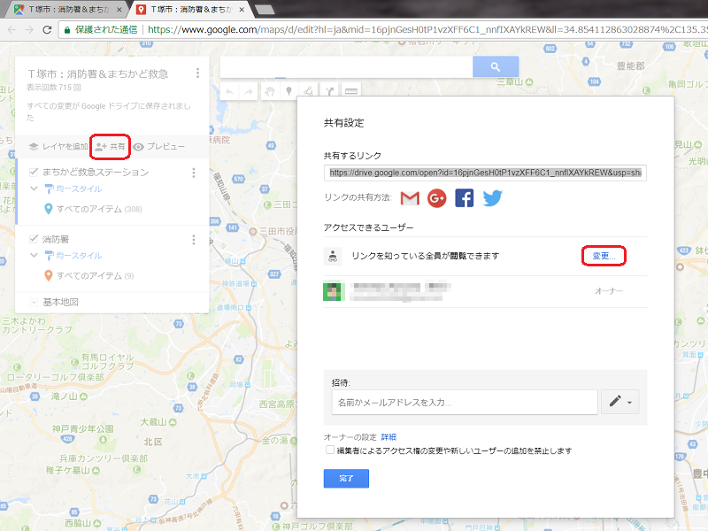

「オン - リンクを知っている全員」から「オン - ウェブ上で一般公開」にして、アクセスを「閲覧者」に設定します

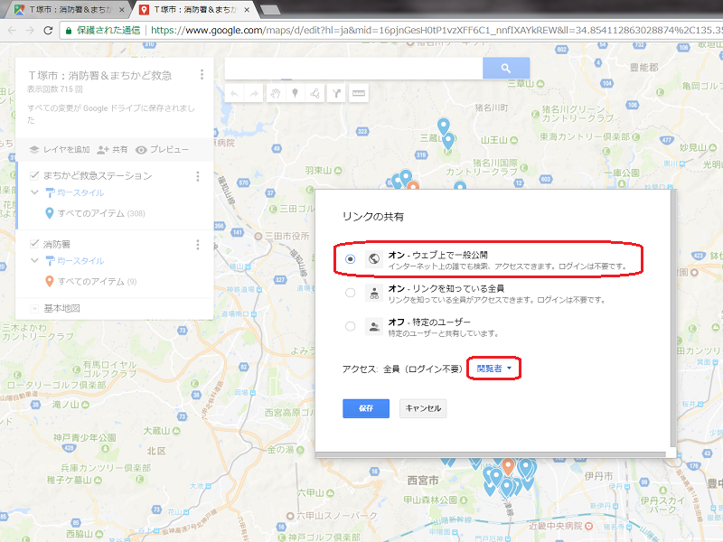

このマイマップはインターネットで全て見える状態になったことを認識してください

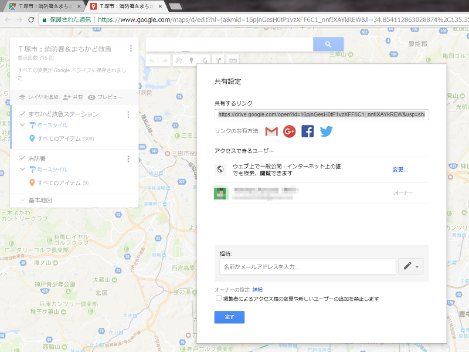

マイマップのタイトル右横の３点をクリックしてメニューを表示し「自分のサイトに埋め込む」を選ぶ

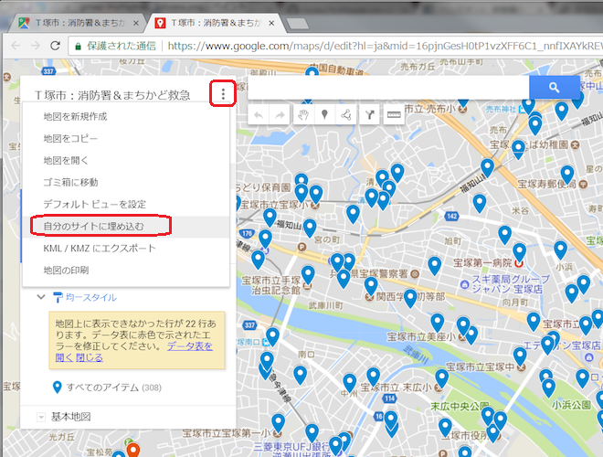

ホームページに埋め込むための <iframe> タグのHTMLが表示されるので、このHTMLをコピーして取得する

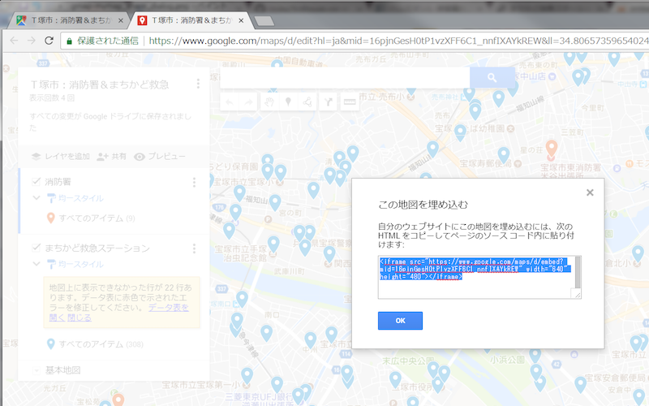

ホームページに埋め込む
======================

埋め込み用のHTMLを実際にホームページに埋め込みます

.. code-block:: html

    <iframe
      src="https://www.google.com/maps/d/u/0/embed?mid=16pjnGesH0tP1vzXFF6C1_nnfIXAYkREW"
      width="640"
      height="480"></iframe>

.. raw:: html

    <iframe src="https://www.google.com/maps/d/u/0/embed?mid=16pjnGesH0tP1vzXFF6C1_nnfIXAYkREW" width="640" height="480"></iframe>

ただし、倍率が広すぎたり見栄えがいまいちですね。また、地図を表示した時に中心位置を意図した位置にしたかったりもありますよね

iframeタグのsrcに地図のURLを当てはめていますが、そのURLにオプションを追加することで表示をアレンジできます

.. csv-table::
   :header: キー, 設定内容

   ll=,"緯度(lat),経度(lng)"
   z=,倍率

取得した埋め込み用のURLに、中心位置と倍率のオプションを反映してみました

.. code-block:: html

    <iframe 
     src="https://www.google.com/maps/d/embed?mid=16pjnGesH0tP1vzXFF6C1_nnfIXAYkREW&ll=34.79960279193115,135.35992562770844&z=15" 
     width="640" 
     height="480"></iframe>

.. raw:: html

    <iframe 
     src="https://www.google.com/maps/d/embed?mid=16pjnGesH0tP1vzXFF6C1_nnfIXAYkREW&ll=34.79960279193115,135.35992562770844&z=15" 
     width="640" 
     height="480"></iframe>

あとは、埋め込むホームページのレイアウトに合わせて、width（幅）、height（高さ）も調整してみてください

