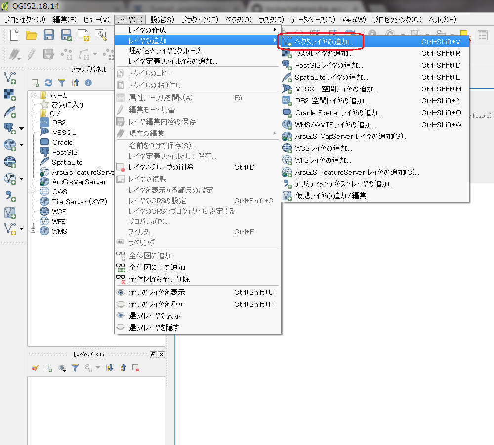
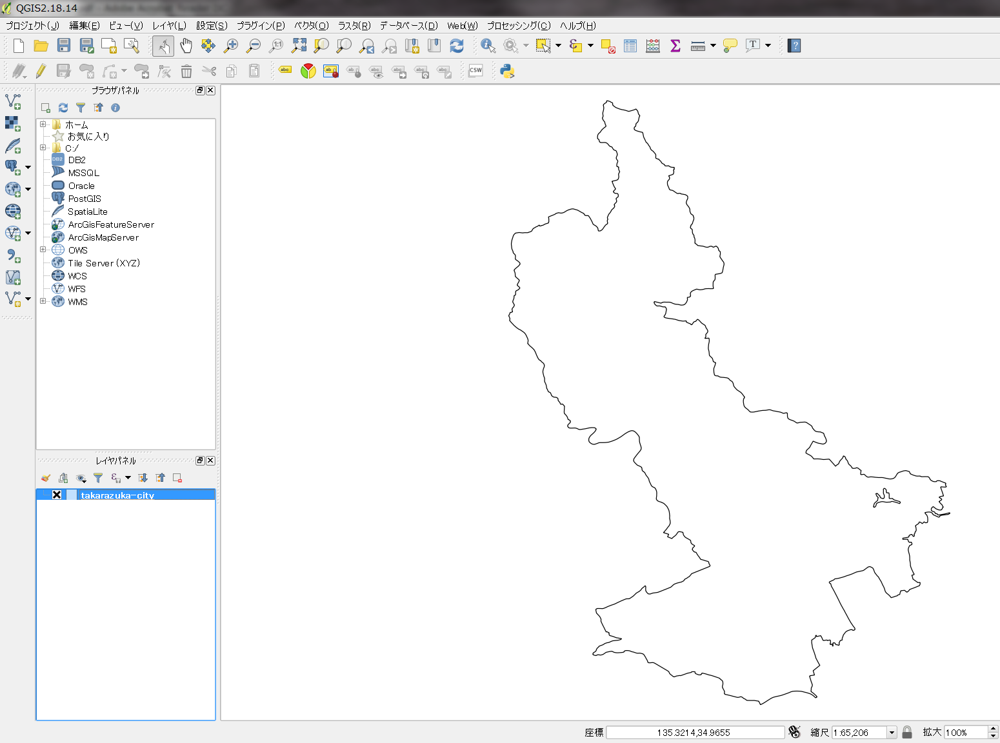
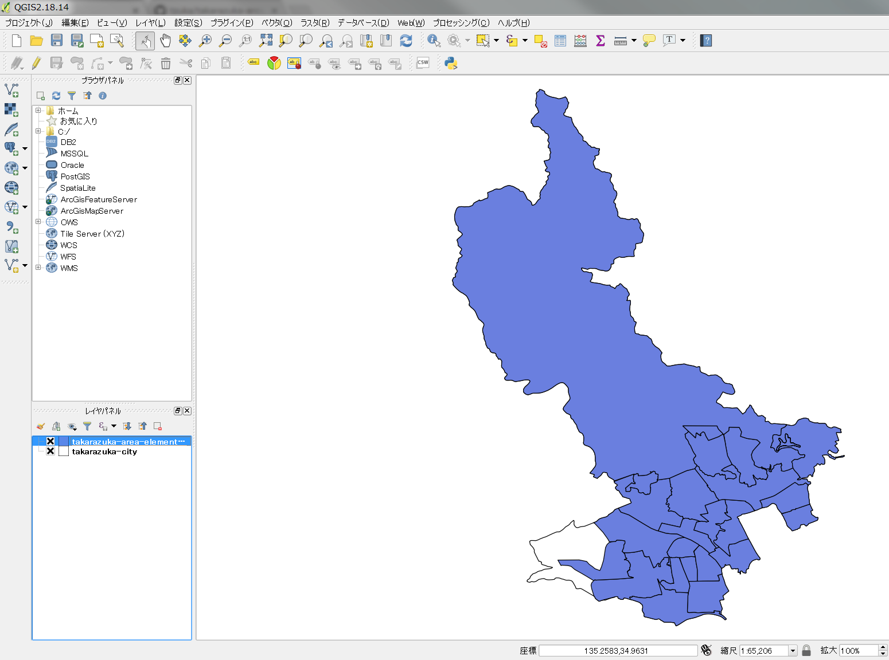
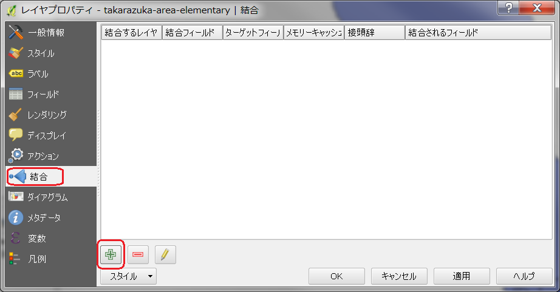

===================================
市のヒートマップを作ろう
===================================

市を小学校区で区切った単位で可視化してビジュアル的に訴えよう！

完成イメージ
============

==========================================================================================================   ============
データマッピング前                                                                                           完成イメージ
==========================================================================================================   ============
.. image:: https://raw.githubusercontent.com/kon104/tzuka/master/qgis/takarazuka-area-elementary-white.png   .. image:: https://raw.githubusercontent.com/kon104/tzuka/master/qgis/takarazuka-area-elementary-heat.png
==========================================================================================================   ============

- https://github.com/kon104/tzuka/blob/master/qgis/takarazuka-area-elementary-white.png
- https://github.com/kon104/tzuka/blob/master/qgis/takarazuka-area-elementary-heat.png

事前準備
========

GISソフトウエア
---------------

本資料での説明で利用している GIS は、オープンソースの地理情報システムである「QGIS」を利用して進めます

- `QGIS 公式サイト <https://qgis.org/ja/site/>`_

なお、ソフトウエアのインストール方法や使い方は、国土交通省が公開されてるマニュアルなどを参考にしてみてください

- `QGIS 操作マニュアル - GISホームページ - 国土交通省 <http://nlftp.mlit.go.jp/ksj/other/manual.pdf>`_

シェープデータ（ポリゴン）
-------------------------

GISで市の図形を扱うためのポリンゴンデータで、国土交通省の `国土数値情報ダウンロードサービス <http://nlftp.mlit.go.jp/ksj/>`_ の「２．政策区域」からダウンロードできるシェイプファイルが県単位であるため、事前に市単位で切り出して加工して用意しておきます

以下のリポジトリに、市全体と市内の小学校区で切り出したシェイプファイルを用意しておきましたので、ダウンロードしてご利用いただいても構いません

- `宝塚市全体のシェープファイル <https://github.com/kon104/tzuka/tree/master/qgis/shape-takarazuka/city>`_
- `小学校区のシェープファイル <https://github.com/kon104/tzuka/tree/master/qgis/shape-takarazuka/area-elementary>`_

ヒートマップしたい数値データ
----------------------------

CSV形式で一行あたり ``小学校区名,数値`` の書式で、小学校区分の行数でCSVファイルを用意してください ::

  小学校区,値
  西山小学校,23.93
  すみれガ丘小学校,60.56
  安倉小学校,96.39
  (以下省略)

- `サンプルCSVデータ <https://raw.githubusercontent.com/kon104/tzuka/master/qgis/takarazuka-area-elementary.csv>`_

取り急ぎ画像を貼り付け
======================

.. image:: ./image/qgis-heatmap/dialog-vector_layer.png

.. image:: ./image/qgis-heatmap/layer_prop-style.png
.. image:: ./image/qgis-heatmap/layer_prop-style_click_layer_rendering.png
.. image:: ./image/qgis-heatmap/layer_prop-chnge_color.png

.. image:: ./image/qgis-heatmap/qgis-menu-add_delimitedlayer.png

.. image:: ./image/qgis-heatmap/layer_prop-merge_after.png
.. image:: ./image/qgis-heatmap/layer_prop-style_change_symbol.png
.. image:: ./image/qgis-heatmap/layer_prop-style_dankai.png
.. image:: ./image/qgis-heatmap/qgis-completion.png

