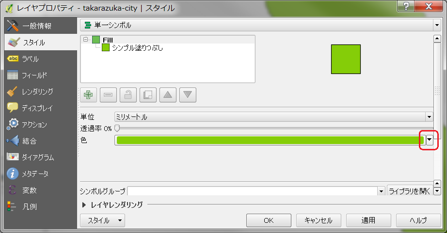
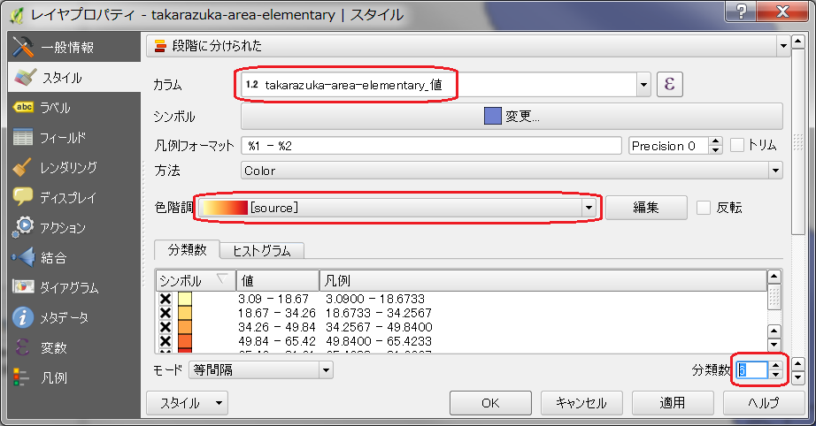
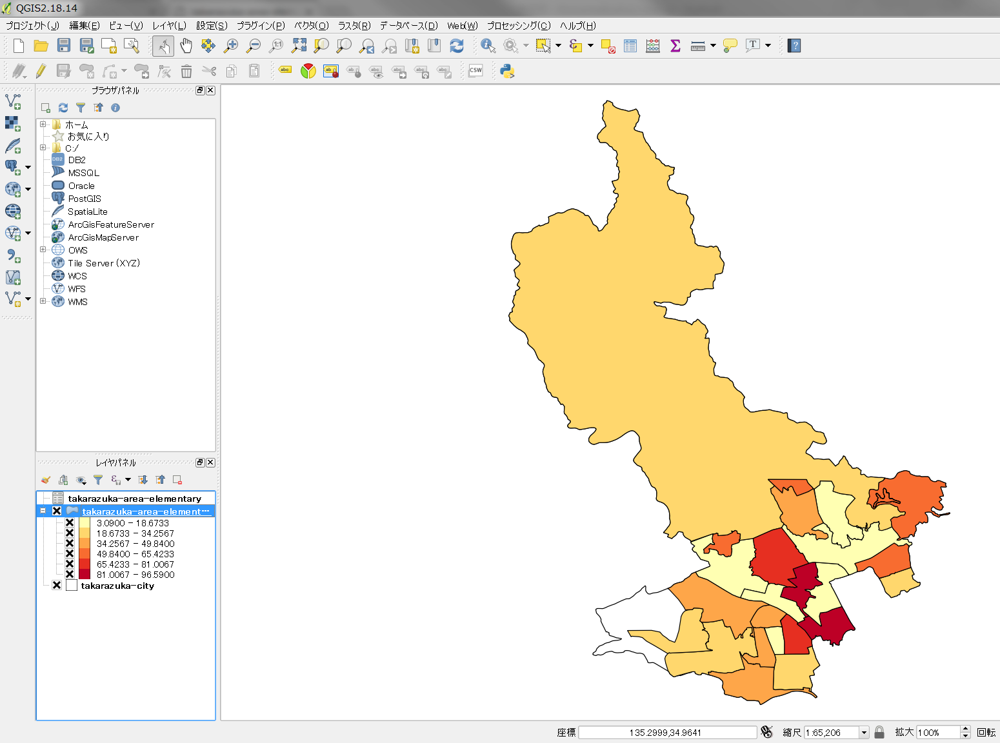

===================================
市のヒートマップを作ろう
===================================

市を小学校区で区切った単位で可視化してビジュアル的に訴えよう！

完成イメージ
============

==========================================================================================================   ============
データマッピング前                                                                                           完成イメージ
==========================================================================================================   ============
.. image:: https://raw.githubusercontent.com/kon104/tzuka/master/qgis/takarazuka-area-elementary-white.png   .. image:: https://raw.githubusercontent.com/kon104/tzuka/master/qgis/takarazuka-area-elementary-heat.png
==========================================================================================================   ============

- https://github.com/kon104/tzuka/blob/master/qgis/takarazuka-area-elementary-white.png
- https://github.com/kon104/tzuka/blob/master/qgis/takarazuka-area-elementary-heat.png

事前準備
========

GISソフトウエア
---------------

本資料での説明で利用している GIS は、オープンソースの地理情報システムである「QGIS」を利用して進めます

- `QGIS 公式サイト <https://qgis.org/ja/site/>`_

なお、ソフトウエアのインストール方法や使い方は、国土交通省が公開されてるマニュアルなどを参考にしてみてください

- `QGIS 操作マニュアル - GISホームページ - 国土交通省 <http://nlftp.mlit.go.jp/ksj/other/manual.pdf>`_

シェープデータ（ポリゴン）
--------------------------

GISで市の図形を扱うためのポリンゴンデータで、国土交通省の `国土数値情報ダウンロードサービス <http://nlftp.mlit.go.jp/ksj/>`_ の「２．政策区域」からダウンロードできるシェイプファイルが県単位であるため、事前に市単位で切り出して加工して用意しておきます

参考として Git リポジトリに市全体と市内の小学校区で切り出したシェイプファイルを用意しておきました

- `市全体のシェープファイル <https://github.com/kon104/tzuka/tree/master/qgis/shape-takarazuka/city>`_
- `小学校区のシェープファイル <https://github.com/kon104/tzuka/tree/master/qgis/shape-takarazuka/area-elementary>`_

利用する場合は、リポジトリを一括ダウンロード（`master.zip <https://github.com/kon104/tzuka/archive/master.zip>`_）して展開したなかから以下のフォルダにファイルがあります

.. code-block:: none

  tzuka-master/
  │
  └── qgis
      └── shape-takarazuka
          │
          ├── area-elementary
          │   ├── takarazuka-area-elementary.shp *
          │   ├── takarazuka-area-elementary.cpg
          │   ├── takarazuka-area-elementary.dbf
          │   ├── takarazuka-area-elementary.prj
          │   ├── takarazuka-area-elementary.qpj
          │   └── takarazuka-area-elementary.shx
          │
          └── city
              ├── takarazuka-city.shp *
              ├── takarazuka-city.cpg
              ├── takarazuka-city.dbf
              ├── takarazuka-city.prj
              ├── takarazuka-city.qpj
              └── takarazuka-city.shx

ヒートマップしたい数値データ
----------------------------

CSV形式で一行あたり ``小学校区名,数値`` の書式で、小学校区分の行数でCSVファイルを用意してください ::

.. code-block:: none

  小学校区,値
  西山小学校,23.93
  すみれガ丘小学校,60.56
  安倉小学校,96.39
  (以下省略)

- `サンプルCSVデータ <https://raw.githubusercontent.com/kon104/tzuka/master/qgis/takarazuka-area-elementary.csv>`_

ヒートマップ作成手順
======================

市全体のシェイプを読み込む
--------------------------

シェイプを読み込むには、メニューバーの「レイヤ ＞ レイヤの追加 ＞ ベクタレイヤの追加」を選びます

.. image:: ./image/qgis-heatmap/qgis-add_vectorlayer.png

ベクタレイヤの追加ダイアログが表示されたら、ソースタイプに「ファイル」とエンコーディングに「Shift_JIS」を選び、データセットに市全体のシェイプファイルの「takarazuka-city.shp」を選択します

市全体のシェイプが表示されたら白色にしたいので、レイヤパネルで市全体のシェイプのレイヤで右クリックしショートカットメニューを表示し「プロパティ」を選びます

.. image:: ./image/qgis-heatmap/qgis-popmenu_layersprop.png

レイヤプロパティのダイアログが表示された「レイヤレンダリング」をクリックします

.. image:: ./image/qgis-heatmap/layer_prop-style.png

色変更のドロップダウン項目が表示されたら右端の▼をクリックします

色選択のポップアップが表示されたら、その中から白色を選びます

市全体のシェイプが白色になりました

.. image:: ./image/qgis-heatmap/qgis-load_city.png

小学校区のシェイプを読み込む
----------------------------

小学校区のシェイプファイル「takarazuka-area-elementary.shp」を読み込みますが、手順は市全体の場合と同じなので割愛します

.. image:: ./image/qgis-heatmap/qgis-load_elementary.png

小学校区のシェイプにデータを被せてヒートマップで表現
----------------------------------------------------

ヒートマップしたいデータもレイヤの一つとして取り込みます。データの取り込みはメニューバーの「レイヤ ＞ レイヤの追加 ＞ デリミテッドテキストレイヤの追加」を選びます

デリミテッドテキストファイルからレイヤを作成のダイアログが表示されたら以下の項目を入力します

- ファイル名に「読み込ませたいCSVファイル」
- エンコーディングに「CSVファイルの文字コード（Excelで作った場合は「Shift_JIS」）」
- ファイル形式に「CSV（コンマで区切られた値）」
- ジオメトリ定義に「ジオメトリなし（属性のみのテーブル）」

.. image:: ./image/qgis-heatmap/dialog-add_delimitedlayer.png

小学校区のレイヤーの上で右クリックしてプロパティを選ぶ

レイヤプロパティのダイアログで「結合」を選び「＋」ボタンをクリックする

.. image:: ./image/qgis-heatmap/layer_prop-merge_before.png

ベクタ結合の追加ダイアログで、結合フィールドに「小学校区」、ターゲットフィールドに「A27_007」を選ぶ

.. image:: ./image/qgis-heatmap/dialog-add_merge_vector.png

結合するレイヤにCSVの数値データのレイヤが追加されました

「スタイル」を選び、ダイアログ上部のドロップダウンで「単一シンボル」から「段階に分けられた」に変更する

.. image:: ./image/qgis-heatmap/layer_prop-style_change_symbol.png

ヒートマップの修飾方法を設定します

- カラムに「takarazuka-area-elementary_値」を選ぶ
- 色階調に暖色系、寒色系などの表現したいデータのヒートマップにあった色を選ぶ
- 分類数は数値をいじりながらヒートマップの段階を調整する

ヒートマップが完成しました

